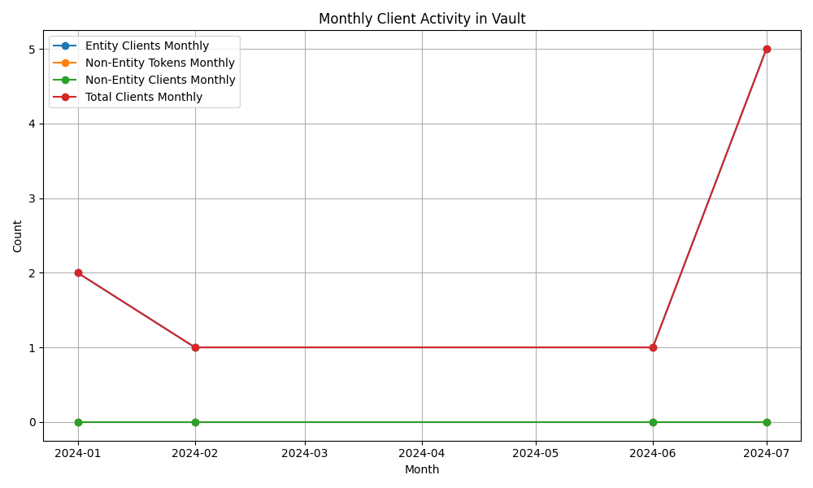
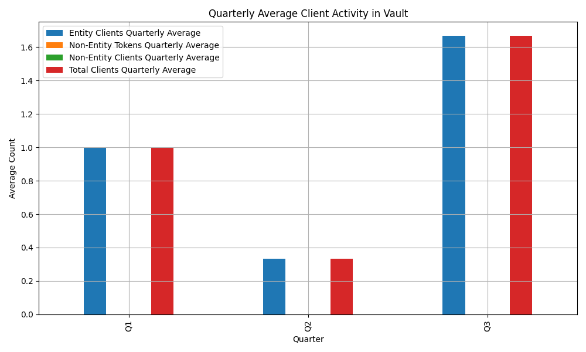

# Vault Client Activity Analysis

This repository contains a Python script for analyzing and visualizing Vault client activity (**only active clients**) on a monthly and quarterly basis. The script reads JSON data from a file, calculates monthly and quarterly averages, and plots the results.

## Prerequisites

- Python 3.9.6
- Pandas
- Matplotlib

## Installation

1. Clone the repository:

```sh
git clone https://github.com/lomar92/vault-count-average.git
cd vault-count-average
```

2. Install the required Python packages:

```sh
pip3 install pandas matplotlib
```

## Obtaining Data from Vault

### Option 1: Including the Current Billing Period

To include data from the current billing period, use the following `curl` command. This is useful when it is the middle of the billing month and you want to include the current month's data:

```sh
curl --header "X-Vault-Token: $VAULT_TOKEN" "$VAULT_ADDR/v1/sys/internal/counters/activity?current_billing_period=true" > vault-data-count.json
```

### Option 2: Using Start and End Dates based on Billing Period

If you want to specify a custom start and end date for example a calender quarter, use the following `curl` command. Note that there is a limitation in the Vault API which states that activity data for the current month is only available after the month has concluded:

```sh
curl --header "X-Vault-Token: $VAULT_TOKEN" "$VAULT_ADDR/v1/sys/internal/counters/activity?start_time=2024-01-01T00:00:00Z&end_time=2024-12-31T23:59:59Z" > vault-data-count.json
```

## Usage

1. Place your JSON data file in the repository directory. Ensure the file is named `vault-data-count.json` or adjust the script accordingly.

2. Run the script:

```sh
python3 cq-count-histo-v2.py
```

## Script Overview

The script performs the following steps:

1. **Load JSON Data**: Reads the JSON data from `vault-data-count.json`.

2. **Extract Monthly Data**: Extracts the monthly client activity data from the JSON.

3. **Create DataFrame**: Converts the data into a Pandas DataFrame for easy manipulation.

4. **Filter Data**: Filters the data to include only entries within the year 2024.

5. **Custom Quarterly Assignment**: Assigns each month to a custom quarter. Adjust the quarter definitions as needed.

6. **Calculate Quarterly Averages**: Calculates the average client activity for each quarter.

7. **Plot Monthly Data**: Plots the monthly client activity data.

8. **Plot Quarterly Data**: Plots the quarterly average client activity data.

9. **Print Quarterly Averages**: Outputs the calculated quarterly averages to the console.

## Custom Quarterly Assignment

You can customize the quarterly assignment by modifying the following section in the script. This is the case if you output the json from the billing start until the current month or previous completed month based on start_date and end_date:

```python
# Custom quarterly assignment
quarters = []
for date in df.index:
    if date.month in [1, 2, 3]:
        quarters.append('Q1')
    elif date.month in [4, 5, 6]:
        quarters.append('Q2')
    elif date.month in [7, 8, 9]:
        quarters.append('Q3')
    else:
        quarters.append('Q4')

df['quarter'] = quarters
```

Adjust the month ranges to match your billing periods.

## Output

The script will generate two plots:

1. **Monthly Client Activity**: Shows the monthly count of entity clients, non-entity tokens, non-entity clients, and total clients. This is available in the Vault UI Client Count Dashboard.



2. **Quarterly Average Client Activity**: Shows the quarterly average count of entity clients, non-entity tokens, non-entity clients, and total clients. THIS is NOT available in the Vault UI Client Count Dashboard.



Additionally, the script will print the quarterly averages to the console.
